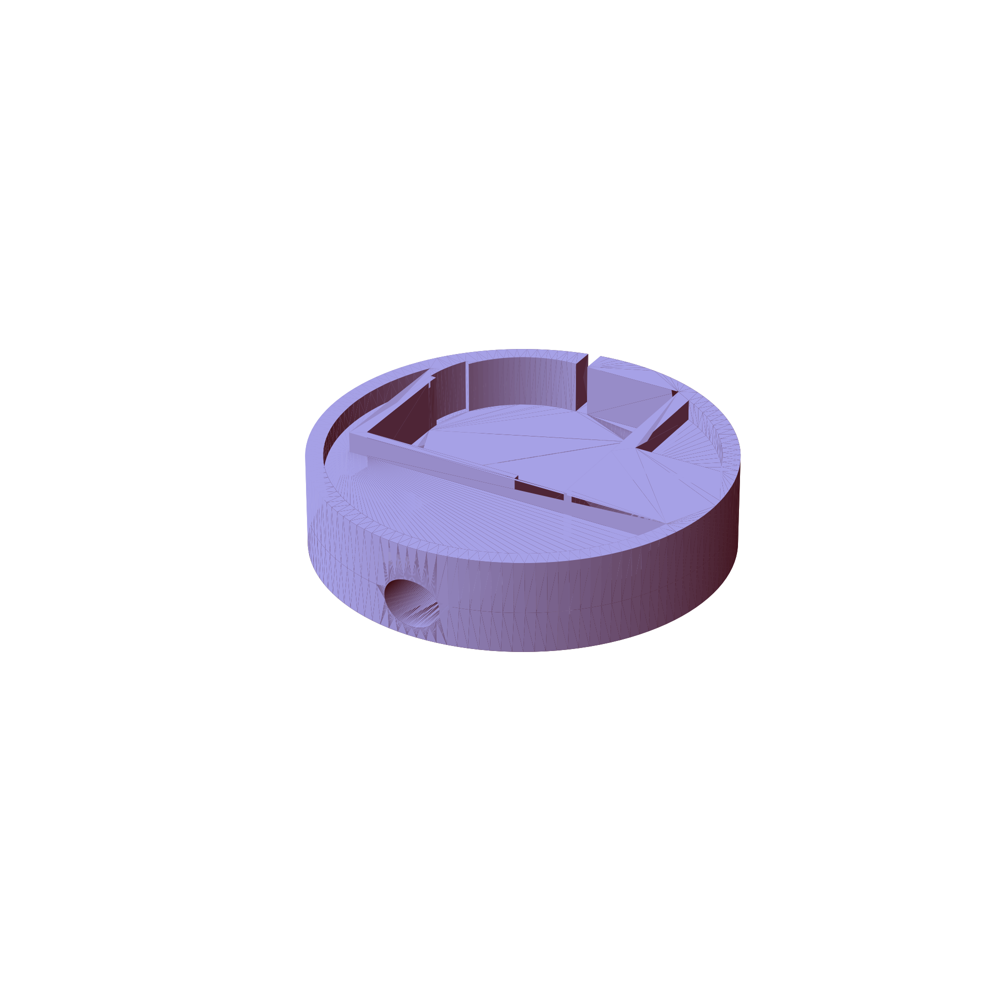

# thundertoad hardware
This repo contains hardware designs related to
[thundertoad](https://github.com/ksu-cs-projects-2022-2023/spring2023-isaacPetersonKSU),
a climate-control and data-logging system for small-scale mushroom growing. All
models are built in [freeCAD](https://www.freecad.org/).

Submodules are used so that the SBCs thundertoad runs on can clone the main
repo without being burdened with storing bulky CAD files.

# exporting files
When changes are made to models, src/export.sh should be invoked. This exports all models in stl format and automatically embeds an image of them to this readme file

# Models
# fan_housing

# only_air

# port_clip

# drill_guide

